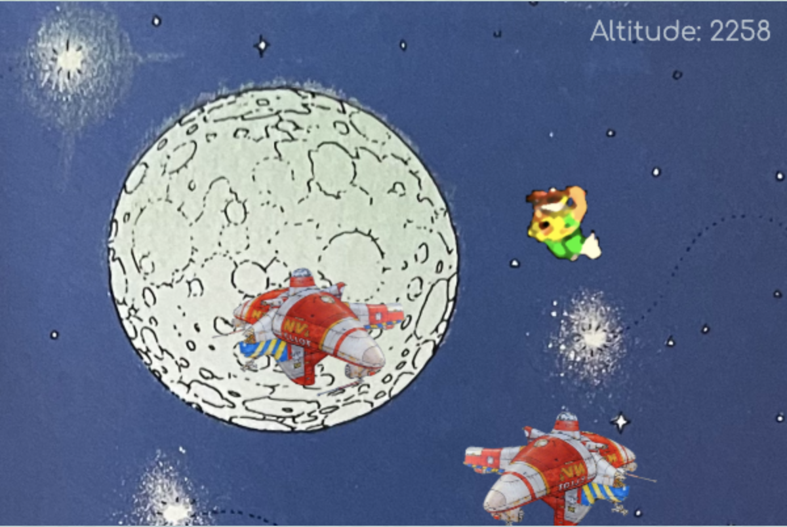
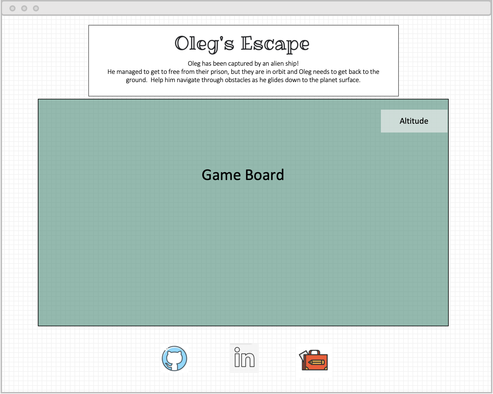

# Oleg’s Escape

## Background 

Based on a character from the Blizzard Classic, The Lost Vikings, this game follows Oleg, a shield-bearing Viking, who recently escaped imprisonment from aliens on their spaceship.  He is free of their custody but is still on their ship!  He must use his mighty shield as a glider to make his way safely to the ground.  He needs your to help to avoid obstacles on his way down.

## Functionality & MVPs

In Oleg’s Escape, users will be able to:
-   Start the game
-	Use computer keys to navigate left and right on the screen 
-	Use navigation to avoid obstacles as they appear on screen
-	View how far they are from the ground on an altitude reader
-	Win or lose the game

In addition, this project will include:
-	Background information on the game, including the rules
-	A legend of keys used for gameplay
-	A production readme 

## Wireframes

## Technologies

-	Canvas
-	Webpack
-	JavaScript
-	HTML, CSS

## Implementation Timeline

**Day 1: 12/30** - General setup, canvas research, sprite research
-   Create canvas, add background

**Day 2:  12/31** - Implement background and obstacles
-	Generate random obstacles 
-	Render background, animate for descent (2 speeds- make it appear the character is descending slowly or quickly)
-	Create start position

**Day 3: 1/2** – Create Oleg, start collision detection
-	Code to lift / lower shield, move right and left while gliding (first implementation will just work off of 4 static images)
-	Add to canvas and test
-   Start collision work

**Day 4: 1/3** - Complete Collision Detection 

**Day 5:  1/4** – Work on game logic
-	Altitude tracker
-	Start
-	Win / lose

**Day 6:  1/5** – Add animation
-   Include sprites for additional movement options

**Day 7: 1/6** - Test and Deploy on GitHub Pages

## Bonus – future features
-  Replace sprites with custom art
-  Add pause, restart options
-  Obstacles will fall from the top and come up from the bottom to make the game more complex
-  Extra points can be gained from picking up prizes on the way down. 
-  Multiple levels
